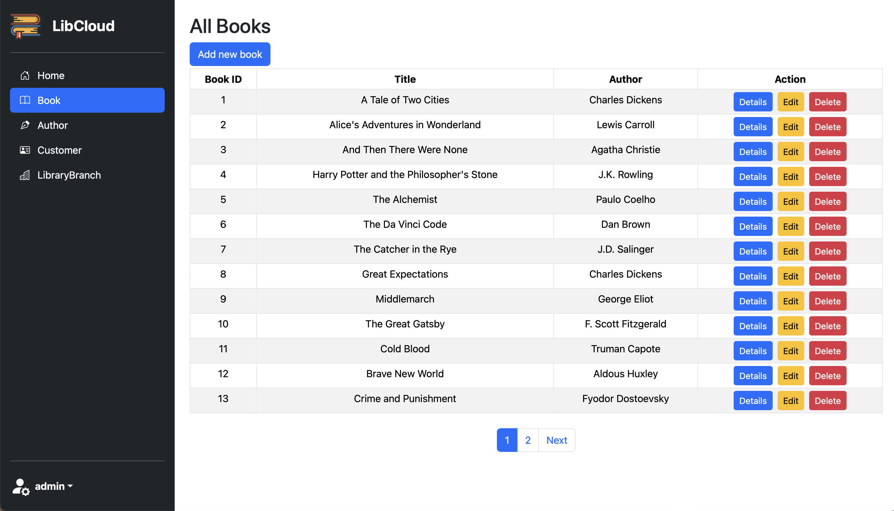

# LibCloud: A Library Management System

## 1. Introduction

The **LibCloud** is an ASP.NET Core MVC project designed to manage books, authors, customers, and library branches. It allows users to perform CRUD (Create, Read, Update, Delete) operations on the library's database. The system uses SQLite as its database and Entity Framework Core for data management.

The system integrates robust authentication features using ASP.NET Core Identity, including user registration, login/logout, and account management. It also supports social media authentication via Google and Facebook, allowing users to sign in with their existing accounts.



## Technologies Used

The project is developed using the following technologies:
- **ASP.NET Core MVC 9.0** - Web framework for building the application.
- **Entity Framework Core (EF Core) 9.0.2** - ORM for database interactions.
- **SQLite** - Lightweight relational database.
- **Bootstrap** - Responsive UI design.
- **X.PagedList.Mvc.Core 10.5.7** - Pagination support for the views.
- **Microsoft.AspNetCore.Identity.EntityFrameworkCore 9.0.0** – Identity management.
- **Microsoft.AspNetCore.Authentication.Facebook 9.0.0** – Social network login for Facebook.
- **Microsoft.AspNetCore.Authentication.Google 9.0.0** – Social network login for Google.
- **SendGrid 9.29.3** – Email service for verification code

## 2. Getting Started

0. **Restore Dependencies:**
   Before running the application, make sure to restore all NuGet packages:
   ```sh
   dotnet restore
   ```
1. **Apply Database Migrations:**
   Run the following commands to create new database:
   ```sh
   dotnet ef migrations add InitialCreate
   dotnet ef database update
   ```
2. **Run the Application:**
   Start the application using the following command: please run the app with https to enable third-party authentication
   ```sh
   dotnet run --launch-profile https
   ```

## 3. Social Media Authentication Setup

To test Google and Facebook login, add the following configuration to your `appsettings.Development.json` file:

```json
"Authentication": {
  "Google": {
      "ClientId": "<your-client-id>",
      "ClientSecret": "<your-client-secret>"
  },
  "Facebook": {
      "AppId": "<your-app-id>",
      "AppSecret": "<your-app-secret>" 
  }
}
```
Replace the placeholders with your actual id and secret


## 4. Email Service Setup

To test email sending functionality using SendGrid, add the following configuration to your `appsettings.Development.json` file:

```json
"SendGrid": {
  "ApiKey": "<your-api-key>",
  "SenderEmail": "<your-sender-email>",
  "SenderName": "LibCloud"
}
```

Replace the placeholders with your actual SendGrid API key and sender information. You can obtain an API key by signing up at [https://sendgrid.com](https://sendgrid.com).
